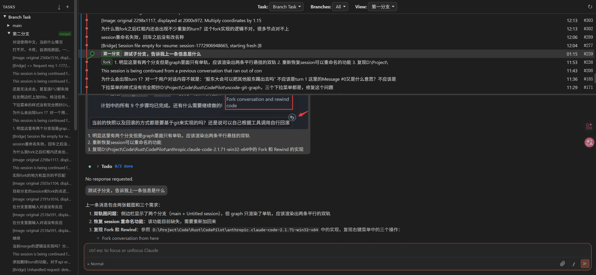

# CodePilot Extension — 深度技术文档

## 概述

CodePilot Extension 是一个完整的 Claude Code 客户端实现，提供 **VSCode 扩展** 和 **独立浏览器** 两种部署模式。其核心功能是：

1. **Claude AI 对话** — 通过 claude.exe CLI 进程进行流式对话
2. **会话分支管理** — Git 风格的对话上下文分支、合并、回滚系统
3. **对话可视化** — SVG 图形化的对话树展示，类似 git log --graph

区别于原版 Claude Code VSCode 扩展，CodePilot 的核心创新是 **完整对话上下文保留**（无压缩截断）和 **Git 风格分支系统**。

## UI 预览



左侧为 Task/Branch/Turn 三级树导航，中间为 Git 风格的对话图，右侧为 ChatView 聊天界面。

---

## 快速开始

### 前置要求

- **Node.js** >= 20
- **npm** >= 9
- **claude.exe** — Anthropic Claude Code 原生二进制（通过 `npm install -g @anthropic-ai/claude-code` 安装，或从 VSCode Claude Code 扩展目录中获取）
- **Git Bash** (Windows) — claude.exe 在 Windows 上依赖 Git Bash 执行 shell 命令

### 安装与构建

```bash
cd extension
npm install          # 安装依赖
npm run build        # 构建所有 target (extension + webview + server)
```

仅构建独立服务器模式（不需要 VSCode）：

```bash
npm run build:server   # 仅构建 server + webview
```

### 启动独立服务器

```bash
npm start              # 构建 + 启动 (默认端口 3000)
# 或者已构建后直接启动
npm run server
```

启动参数：

```bash
node dist/server.js --port 3456 --cwd /path/to/project --binary /path/to/claude.exe
```

| 参数 | 环境变量 | 默认值 | 说明 |
|------|----------|--------|------|
| `--port` | `PORT` | 3000 | HTTP/WebSocket 端口 |
| `--cwd` | `CLAUDE_CWD` | `process.cwd()` | claude.exe 工作目录 |
| `--binary` | `CLAUDE_BINARY` | 自动搜索 | claude.exe 路径 |
| `--host` | `HOST` | 127.0.0.1 | 监听地址 |

启动成功后在浏览器打开 `http://127.0.0.1:3000` 即可使用。

### 作为 VSCode 扩展使用

1. 用 VSCode 打开 `extension/` 目录
2. 按 `F5` 启动 Extension Development Host
3. 在新窗口中按 `Ctrl+Shift+Escape` 打开 CodePilot 面板

### 开发模式

```bash
npm run watch:server   # 监听 server + webview 文件变更，自动重新构建
# 另一个终端
npm run server         # 启动服务器
```

修改代码后刷新浏览器即可看到更新。

---

## 使用说明

### 基本对话

1. 启动服务器后打开浏览器
2. 在右侧 ChatView 输入消息，按 Enter 发送
3. AI 回复会实时流式显示
4. 点击输入框左下角可切换模型、权限模式

### 任务与分支管理

- **创建任务**: 点击侧边栏 "Tasks" 标题右侧的 `+` 按钮
- **创建分支**: 在图中右键某个 Turn 节点 → "Fork & Rewind"（从该点分叉出新分支）
- **切换分支**: 在侧边栏点击不同的 Branch 名称
- **查看 Turn**: 点击侧边栏的 Turn 条目，ChatView 会跳转到对应消息
- **重命名**: 右键 Task 或 Branch → "Rename"
- **删除**: 右键 → "Delete"（分支标记为 deleted，不会物理删除 JSONL 文件）

### 合并分支

1. 右键分支 → "Merge to Parent"，或右键某个 Turn → "Merge up to here"
2. 选择合并范围（支持增量合并，不必一次性合并整个分支）
3. 点击 "Generate AI Summary" 让 AI 生成合并总结
4. 编辑总结文本 → 点击 "Merge"
5. 总结会作为 assistant 消息注入到父分支末尾

### 回退

- 右键 Turn → "Rollback" — 将会话截断到该 Turn（不可逆）
- 使用 "Fork & Rewind" 替代，可以在创建分支保留后续内容的同时回退

### 导入会话

- 点击侧边栏标题的 `↓` 按钮 → 选择已有的 Claude Code 会话导入到当前任务

---

## 注意事项

### 环境配置

- **Windows 用户必须配置 Git Bash 路径**: claude.exe 依赖 Git Bash 来执行 shell 命令。需要设置环境变量 `CLAUDE_CODE_GIT_BASH_PATH` 指向 `bash.exe`（例如 `D:\APP\Git\bin\bash.exe`），或确保 Git 在 PATH 中
- **API Key**: 需要有效的 Anthropic API Key。通过 `ANTHROPIC_API_KEY` 环境变量设置，或在 claude.exe 中已登录
- **CLAUDECODE 环境变量**: 如果系统中存在 `CLAUDECODE` 环境变量，必须删除它（不是设为空字符串），否则 claude.exe 的行为会异常

### 已知限制

1. **依赖 claude.exe**: 本项目不直接调用 Anthropic API，而是通过 claude.exe CLI 进行交互。claude.exe 的版本更新可能导致 stdin/stdout 协议变化
2. **JSONL 文件大小**: 长对话的 JSONL 文件可能达到数 MB，图数据构建和历史回放会有延迟
3. **内存占用**: 每个对话对应一个独立的 claude.exe 进程，多对话并行时内存和 CPU 占用较高
4. **请求超时**: 前端 Connection 层的请求超时固定为 10 秒，AI 生成合并总结时可能超时（长分支内容多时）
5. **Windows Only**: 当前仅在 Windows 11 上测试过。macOS/Linux 理论上可用但未充分验证

### 数据安全

- 所有对话数据存储在本地 `~/.claude/projects/` 目录下的 JSONL 文件中，不会上传到任何第三方服务
- `.codepilot-meta.json` 存储任务和分支元数据，位于会话目录中
- 删除分支时仅标记 `status: "deleted"`，JSONL 文件不会被物理删除。如需彻底清理，手动删除对应的 `.jsonl` 文件

### 与原版 Claude Code 的共存

- 本项目复用 claude.exe 的会话存储格式（JSONL），因此 CodePilot 创建的会话在 Claude Code CLI 中也可以 `--resume`
- `.codepilot-meta.json` 是 CodePilot 独有的元数据文件，不影响原版 Claude Code 的正常使用
- 建议不要同时在 CodePilot 和原版 Claude Code 中操作同一个会话，避免 JSONL 文件写入冲突

---

## 架构总览

```
┌─────────────────────────────────────────────────────────────────┐
│                     浏览器 / VSCode Webview                      │
│                                                                 │
│  React 18 (App → BranchGraphView → SidebarTree + GraphTable     │
│            + ConversationGraph + ChatView → MessageBubble        │
│            + InputBox + MergeDialog + ToolRenderer)              │
│                                                                 │
│  Connection (auto-detect: postMessage / WebSocket)               │
│  Session + StreamAssembler (会话状态管理 + SSE 流重组)             │
└───────────────────────────┬─────────────────────────────────────┘
                            │ JSON messages
                            │ (postMessage 或 WebSocket)
┌───────────────────────────┴─────────────────────────────────────┐
│              Extension Host / Standalone Server                   │
│                                                                 │
│  VSCode 模式: src/extension.ts → WebviewPanelManager             │
│                → ChannelManager → client-server.ts               │
│                                                                 │
│  独立模式: server/index.ts (HTTP + WebSocket)                     │
│             → ClientBridge (server/bridge.ts, 3100+ 行)          │
│             → MCP Server (IDE 工具回调)                           │
│                                                                 │
│  功能: 请求路由(40+ 请求类型)、CLI 进程管理、                      │
│        JSONL 文件操作、.codepilot-meta.json 管理、                │
│        分支/合并/回滚逻辑                                         │
└───────────────────────────┬─────────────────────────────────────┘
                            │ stdin/stdout NDJSON
                            │ (stream-json 格式)
┌───────────────────────────┴─────────────────────────────────────┐
│                        claude.exe                                │
│  Anthropic Claude Code 原生二进制                                 │
│  --input-format stream-json --output-format stream-json          │
│  --verbose                                                       │
└─────────────────────────────────────────────────────────────────┘
```

### 双部署模式

| 模式 | 入口 | 传输层 | 备注 |
|------|------|--------|------|
| **VSCode 扩展** | `src/extension.ts` → `dist/extension.js` | `window.vscodeApi.postMessage()` | 需要 VSCode 1.94+ |
| **独立浏览器** | `server/index.ts` → `dist/server.js` | WebSocket (`ws://host:port/ws`) | `npm start` 即可运行 |

浏览器端 `Connection.ts` 自动检测：存在 `window.vscodeApi` 则用 postMessage，否则用 WebSocket。

---

## 目录结构

```
extension/
├── package.json                    # 扩展清单 + 依赖 + scripts
├── tsconfig.json                   # 主 TS 配置 (extension)
├── tsconfig.server.json            # Server TS 配置
├── tsconfig.webview.json           # Webview TS 配置
├── esbuild.config.mjs              # 构建配置 (3 个 target)
├── claude-code-settings.schema.json # Claude Code 设置 JSON Schema
│
├── src/                            # VSCode 扩展端代码
│   ├── extension.ts                # 扩展入口 (activate/deactivate)
│   ├── cli/
│   │   ├── channel.ts              # CLI 通道管理 (多会话)
│   │   ├── control-handler.ts      # CLI 控制请求处理
│   │   └── process-manager.ts      # claude.exe 进程生命周期
│   ├── mcp/
│   │   ├── mcp-server.ts           # MCP Server 实现
│   │   └── mcp-tools.ts            # MCP 工具定义 (IDE 回调)
│   ├── providers/
│   │   ├── webview-content.ts      # Webview HTML 生成
│   │   └── webview-panel.ts        # WebviewPanel + Sidebar Provider
│   ├── services/
│   │   └── client-server.ts        # VSCode 模式的消息路由
│   ├── session/
│   │   ├── session-reader.ts       # 会话 JSONL 读取
│   │   ├── session-store.ts        # 会话存储管理
│   │   └── session-writer.ts       # 会话 JSONL 写入
│   ├── types/
│   │   ├── branch-graph.ts         # 分支系统类型定义
│   │   ├── cli-protocol.ts         # CLI stdin/stdout 消息类型
│   │   └── webview-protocol.ts     # Webview ↔ Extension 消息类型
│   └── utils/
│       ├── async-stream.ts         # 异步流工具
│       └── logger.ts               # 日志工具
│
├── server/                         # 独立服务器端代码
│   ├── index.ts                    # HTTP + WebSocket 服务器入口
│   └── bridge.ts                   # 核心消息路由 (3123 行)
│
├── webview/                        # React 前端代码
│   ├── index.tsx                   # React 18 入口 (createRoot)
│   ├── App.tsx                     # 根组件 → BranchGraphView
│   ├── ErrorBoundary.tsx           # React 错误边界
│   ├── chat/
│   │   ├── ChatView.tsx            # 主聊天容器 (消息列表 + 输入框)
│   │   ├── MessageBubble.tsx       # 单条消息渲染 (Markdown + 工具)
│   │   ├── EmptyState.tsx          # 空对话欢迎页
│   │   └── CompactBoundary.tsx     # 上下文压缩边界标记
│   ├── connection/
│   │   └── Connection.ts           # 双模式通信层 (postMessage/WebSocket)
│   ├── graph/
│   │   ├── BranchGraphView.tsx     # 分支管理主视图 (整合侧边栏+图+聊天)
│   │   ├── ConversationGraph.ts    # SVG 图形布局引擎
│   │   ├── GraphTable.tsx          # 图表渲染 (SVG + 节点详情)
│   │   ├── GraphControls.tsx       # 图表控制工具栏
│   │   ├── SidebarTree.tsx         # 3 级树导航 (Task→Branch→Turn)
│   │   ├── MergeDialog.tsx         # 分支合并对话框
│   │   ├── Dropdown.tsx            # 下拉菜单组件
│   │   └── graph.css               # 图形化样式
│   ├── input/
│   │   ├── InputBox.tsx            # 消息输入框 (多行 + 快捷键)
│   │   ├── ModelMenu.tsx           # 模型选择菜单
│   │   ├── PermissionModeMenu.tsx  # 权限模式菜单
│   │   └── SlashCommandMenu.tsx    # 斜杠命令菜单
│   ├── markdown/
│   │   └── renderMarkdown.ts       # Markdown→HTML 渲染管线
│   ├── messages/
│   │   ├── MessageModel.ts         # 消息数据模型
│   │   ├── StreamAssembler.ts      # SSE 流重组器
│   │   └── compaction.ts           # 上下文压缩处理
│   ├── permissions/
│   │   └── PermissionRequest.tsx   # 工具权限请求 UI
│   ├── session/
│   │   ├── Session.ts              # 会话状态机
│   │   └── SessionList.tsx         # 会话列表 (历史)
│   ├── styles/
│   │   └── global.css              # 全局样式
│   └── tools/
│       └── ToolRenderer.tsx        # 工具使用结果渲染
│
├── resources/                      # 静态资源
│   ├── claude-logo.png
│   └── claude-logo.svg
│
├── dist/                           # 构建产出
│   ├── extension.js                # VSCode 扩展 bundle
│   ├── server.js                   # 独立服务器 bundle
│   └── webview/
│       └── index.js                # React 前端 bundle
│
└── log/                            # 运行时日志
```

---

## 构建系统

使用 **esbuild** 构建，配置在 `esbuild.config.mjs`，包含 3 个独立 target：

| Target | 入口 | 输出 | 格式 | 平台 |
|--------|------|------|------|------|
| **extension** | `src/extension.ts` | `dist/extension.js` | CJS | Node 20 |
| **webview** | `webview/index.tsx` | `dist/webview/index.js` | ESM | Browser (ES2022) |
| **server** | `server/index.ts` | `dist/server.js` | CJS | Node 20 |

### npm scripts

```bash
npm run build          # 构建所有 3 个 target
npm run build:server   # 仅构建 server + webview
npm run watch          # 监听模式 (全部)
npm run watch:server   # 监听模式 (server + webview)
npm start              # 构建 server + webview 并启动
npm run server         # 启动已构建的服务器
npm run lint           # TypeScript 类型检查
npm run lint:server    # Server 类型检查
```

### 独立服务器启动

```bash
node dist/server.js [--port 3000] [--cwd /path/to/project] [--binary /path/to/claude.exe]
```

环境变量替代：`PORT`, `CLAUDE_CWD`, `CLAUDE_BINARY`, `HOST`

二进制自动搜索顺序：
1. `resources/native-binary/claude.exe` (相对路径)
2. 同级 `anthropic.claude-code-*/resources/native-binary/` 目录
3. `PATH` 环境变量中的 `claude.exe`
4. npm 全局安装路径

---

## 依赖

### 运行时依赖

| 包 | 版本 | 用途 |
|----|------|------|
| `react` / `react-dom` | ^18.3.1 | UI 框架 |
| `ws` | ^8.16.0 | WebSocket 服务器/客户端 |
| `marked` | ^17.0.4 | Markdown 解析 |
| `unified` / `remark-*` / `rehype-*` | ^11~15 | Markdown→HTML 渲染管线 |
| `rehype-highlight` | ^7.0.0 | 代码高亮 |
| `dompurify` | ^3.1.0 | HTML 安全净化 |
| `diff` | ^5.2.0 | 文件差异计算 |
| `@anthropic-ai/sdk` | ^0.70.0 | Anthropic API 类型 |

### 开发依赖

| 包 | 版本 | 用途 |
|----|------|------|
| `typescript` | ^5.5.0 | 类型系统 |
| `esbuild` | ^0.24.0 | 构建工具 |
| `@types/node` | ^20.0.0 | Node.js 类型 |
| `@types/react` / `@types/react-dom` | ^18.3.0 | React 类型 |
| `@types/vscode` | ^1.94.0 | VSCode API 类型 |
| `@types/ws` | ^8.5.0 | WebSocket 类型 |

---

## 核心子系统详解

### 1. 通信层 (Connection)

**文件**: `webview/connection/Connection.ts`

Connection 是一个单例，自动检测运行环境并选择传输层：

```
Browser检测: window.vscodeApi 存在？
  ├─ 是 → PostMessageTransport (VSCode webview)
  └─ 否 → WebSocketTransport (独立浏览器)
```

核心 API：

| 方法 | 说明 |
|------|------|
| `launchClaude(options)` | 发送 `launch_claude` 消息，启动 claude.exe |
| `sendUserMessage(channelId, content)` | 发送用户消息到 CLI |
| `sendRequest<T>(request, channelId?)` | 发送请求并等待响应 (Promise, 10s 超时) |
| `sendResponse(requestId, response)` | 响应服务端请求 (如工具权限) |
| `interrupt(channelId)` | 中断当前 AI 回复 |
| `closeChannel(channelId)` | 关闭通道 (终止 claude.exe 进程) |
| `onMessageReceived(handler)` | 注册消息监听器 |

消息格式：
- Extension→Webview: `{ type: "from-extension", message: ExtensionToWebview }`
- Webview→Extension: 直接发送 `WebviewToExtension` 对象

### 2. CLI 进程管理 (Bridge)

**文件**: `server/bridge.ts` (3123 行)

每个 WebSocket 连接对应一个 `ClientBridge` 实例，管理多个 **Channel**（每个 Channel 对应一个 claude.exe 进程）。

#### 进程启动

claude.exe 启动参数：
```
claude.exe --input-format stream-json
           --output-format stream-json
           --verbose
           [--resume <sessionId>]
           [--model <model>]
           [--permission-mode <mode>]
```

关键环境变量：
```
ANTHROPIC_API_KEY         # API 密钥
CLAUDE_CODE_GIT_BASH_PATH # Windows 必须 (Git Bash 路径)
CLAUDE_CODE_ENTRYPOINT    # "claude-vscode"
MCP_CONNECTION_NONBLOCKING # "true"
CLAUDE_MCP_LOCALHOST_PORT  # MCP 回调端口
```

**重要行为**: claude.exe 启动后不会主动发送 system init 消息，必须先发一条空用户消息触发：
```json
{"type":"user","message":{"role":"user","content":[]},"session_id":"","parent_tool_use_id":null}
```
桥接器发送此暖启动消息后，过滤掉 CLI 的暖启动回复（只转发 system init 到前端）。

#### 消息路由

`processRequest()` 方法处理 40+ 种请求类型，按功能分组：

**会话管理**:
- `init` — 初始化确认
- `list_sessions_request` — 列出所有会话
- `get_session_request` — 获取会话详情
- `delete_session` — 删除会话
- `rename_session` — 重命名会话
- `reorder_sessions` — 重排会话顺序
- `get_session_messages` — 获取会话消息 (用于 lazy load)

**分支管理** (Branch Graph):
- `create_task` — 创建任务 (新建 JSONL + meta 记录)
- `rename_task` — 重命名任务
- `delete_task` — 删除任务 (级联删除所有分支)
- `reorder_tasks` — 重排任务顺序
- `create_branch` — 从指定 turn 创建分支 (复制 JSONL 到 forkIndex)
- `rename_branch` — 重命名分支
- `merge_branch` — 增量合并分支 (AI 总结注入父分支)
- `delete_branch` — 删除分支 (标记 status=deleted)
- `fork_and_rewind` — 分叉并回退 (先 fork，再截断原分支)
- `rollback_session` — 回退会话到指定 turn
- `delete_turn` — 删除指定 turn 及之后的消息

**图形数据**:
- `get_branch_graph` — 构建完整对话图数据 (节点+边)
- `get_sidebar_tree` — 构建 3 级侧边栏树
- `get_merge_preview` — 获取合并预览 (范围查询)
- `generate_merge_summary` — AI 生成合并总结 (claude.exe -p)

**文件/IDE 操作**:
- `list_files_request` — 列出工作区文件
- `open_file` / `open_diff` — 打开文件/差异视图
- `exec` — 执行 shell 命令
- `check_git_status` — 检查 git 状态

**会话迁移**:
- `move_session_to_task` — 移动会话到指定任务
- `create_task_from_session` — 从会话创建新任务
- `import_session_to_task` — 导入外部会话到任务
- `list_importable_sessions` — 列出可导入的会话

### 3. 会话状态机 (Session)

**文件**: `webview/session/Session.ts`

Session 是每个对话的状态容器，状态机如下：

```
connecting ──→ idle ──→ streaming ──→ idle
                │          │
                │          └──→ tool_use ──→ streaming / idle
                │
                └──→ waiting_input ──→ idle
                │
                └──→ error
```

| 状态 | 含义 |
|------|------|
| `connecting` | 初始状态，等待 system init |
| `idle` | 空闲，等待用户输入 |
| `streaming` | AI 正在生成回复 |
| `tool_use` | AI 请求使用工具 |
| `waiting_input` | 等待用户权限确认 |
| `error` | 发生错误 |

核心数据：

```typescript
interface SessionState {
  sessionId: string;
  channelId: string;
  status: SessionStatus;
  messages: MessageModel[];      // 所有消息
  model?: string;                // 当前模型
  totalInputTokens: number;      // 累计输入 token
  totalOutputTokens: number;     // 累计输出 token
  totalCost: number;             // 累计费用 (USD)
  permissionMode: string;        // 权限模式
}
```

### 4. 流重组器 (StreamAssembler)

**文件**: `webview/messages/StreamAssembler.ts`

将 Anthropic SSE 事件流重组为完整消息。claude.exe 以 NDJSON 格式发送 SSE 事件：

```
{"type":"stream_event","event":{"type":"message_start","message":{...}}}
{"type":"stream_event","event":{"type":"content_block_start","index":0,...}}
{"type":"stream_event","event":{"type":"content_block_delta","index":0,"delta":{"type":"text_delta","text":"Hello"}}}
{"type":"stream_event","event":{"type":"content_block_delta","index":0,"delta":{"type":"text_delta","text":" world"}}}
{"type":"stream_event","event":{"type":"content_block_stop","index":0}}
{"type":"stream_event","event":{"type":"message_delta","delta":{"stop_reason":"end_turn"},"usage":{...}}}
{"type":"stream_event","event":{"type":"message_stop"}}
```

StreamAssembler 处理：
1. **message_start** → 创建 StreamMessage，Session 状态切换到 streaming
2. **content_block_start** → 添加新 ContentBlock (text/thinking/tool_use)
3. **content_block_delta** → 增量追加文本/JSON/思考内容
4. **content_block_stop** → 标记 block 完成，解析累积的 partial JSON (tool_use input)
5. **message_delta** → 更新 stop_reason 和 usage
6. **message_stop** → 标记消息完成，更新 token 计数

支持 `parentToolUseId` 路由，允许子 agent 的独立消息流。

### 5. 消息数据模型 (MessageModel)

**文件**: `webview/messages/MessageModel.ts`

```typescript
interface MessageModel {
  uuid: string;                    // 唯一标识
  role: "user" | "assistant" | "system";
  content: ContentBlockModel[];    // 内容块列表
  usage?: TokenUsage;              // token 使用统计
  model?: string;                  // 使用的模型
  parentToolUseId?: string;        // 子 agent 关联
  isCompacted?: boolean;           // 已被压缩标记
  compactMetadata?: CompactMetadata; // 压缩元数据
  isCompactBoundary?: boolean;     // 压缩边界标记
}
```

内容块类型 (`ContentBlock`):

| 类型 | 说明 |
|------|------|
| `text` | 纯文本 (支持 Markdown + citations) |
| `thinking` | AI 思考过程 (extended thinking) |
| `redacted_thinking` | 已编辑的思考内容 |
| `tool_use` | 客户端工具调用 (Bash, Read, Edit 等) |
| `server_tool_use` | 服务器端工具调用 (Web Search 等) |
| `tool_result` | 工具执行结果 |
| `image` | Base64 图片 |
| `document` | Base64 文档 |
| `web_search_tool_result` | 网页搜索结果 |

### 6. 上下文压缩处理 (Compaction)

**文件**: `webview/messages/compaction.ts`

当 claude.exe 发送 `compact_boundary` 系统消息时，表示 AI 的上下文窗口已自动压缩。CodePilot 的处理策略与原版不同：

- **原版行为**: 删除压缩前的消息
- **CodePilot 行为**: 保留所有消息，但标记 `isCompacted = true`

`applyLiveCompaction()` 函数在收到压缩边界时：
1. 遍历现有消息，将压缩边界之前的消息标记为 `isCompacted`
2. 插入一个 `CompactBoundary` 标记消息
3. UI 层通过 `CompactBoundary.tsx` 显示折叠区域

---

## 分支系统详解

### 数据存储

分支系统使用两种文件：

**1. 会话 JSONL 文件** (`~/.claude/projects/<hash>/sessions/<sessionId>.jsonl`)

每个会话一个文件，每行一个 JSON 对象。格式：

```jsonl
{"type":"system","subtype":"init","session_id":"abc","model":"claude-sonnet-4-20250514"}
{"type":"user","uuid":"u1","message":{"role":"user","content":[{"type":"text","text":"你好"}]},...}
{"type":"assistant","uuid":"a1","message":{"role":"assistant","content":[{"type":"text","text":"你好！"}],...},...}
```

**2. 元数据文件** (`.codepilot-meta.json`，位于 sessions 目录)

```typescript
interface CodepilotMeta {
  titles?: Record<string, string>;           // sessionId → 自定义标题
  order?: string[];                          // 会话排序
  tasks?: Record<string, TaskInfo>;          // taskId → 任务信息
  taskOrder?: string[];                      // 任务排序
  branches?: Record<string, BranchInfo>;     // branchSessionId → 分支信息
}
```

### 核心概念

#### Task (任务)

一组相关会话的容器。`taskId === mainSessionId`（主分支的会话 ID）。

```typescript
interface TaskInfo {
  taskId: string;           // = mainSessionId
  taskName: string;         // 用户可见名称
  mainSessionId: string;    // 主分支会话 ID
  createdAt: string;        // ISO 时间戳
  mainBranchName?: string;  // 主分支自定义名称 (默认 "main")
}
```

#### Branch (分支)

从某个会话的某个 turn 分叉出来的新会话。

```typescript
interface BranchInfo {
  parentSessionId: string;  // 父会话 ID (支持多级嵌套)
  forkIndex: number;        // 父 JSONL 中的分叉点 (消息索引)
  branchName: string;       // 分支名称
  createdAt: string;
  status: "active" | "merged" | "deleted";
  depth: number;            // 嵌套深度: 0=main, 1=直接分支, 2+=子分支
  mergeHistory?: MergeRecord[];  // 增量合并历史
}
```

#### MergeRecord (合并记录)

支持增量合并 — 一个分支可以多次部分合并到父分支。

```typescript
interface MergeRecord {
  fromMsgIndex: number;      // 合并范围起始 (用户消息索引)
  toMsgIndex: number;        // 合并范围结束 (inclusive)
  summary: string;           // 注入到父分支的总结文本
  parentMergeIndex: number;  // 父 JSONL 中注入位置
  timestamp: string;
}
```

### 分支操作流程

#### 创建分支 (`create_branch`)

1. 读取父会话 JSONL
2. 复制 forkIndex 之前的所有消息到新 JSONL 文件
3. 在 meta.json 中记录 BranchInfo
4. 返回新 branchSessionId

#### 合并分支 (`merge_branch`)

1. 读取分支 JSONL 中 `[fromMsgIndex, toMsgIndex]` 范围的内容
2. 用户提供（或 AI 生成）合并总结
3. 将总结作为 assistant 消息注入父 JSONL 末尾
4. 追加 MergeRecord 到 `branch.mergeHistory[]`
5. 若 `toMsgIndex >= totalMsgCount - 1`，设置 `status: "merged"`

#### AI 合并总结 (`generate_merge_summary`)

通过 claude.exe 的 one-shot 模式 (`-p` flag) 生成总结：

```typescript
// bridge.ts 中的 runClaudeOneShot()
const proc = cp.spawn(binaryPath, ["-p", "--output-format", "text"], {
  cwd: this.cwd,
  stdio: ["pipe", "pipe", "pipe"],
});
proc.stdin.write(prompt);
proc.stdin.end();
```

#### 回退 (`rollback_session`)

1. 读取 JSONL 所有行
2. 计算目标消息索引在文件中的字节偏移
3. 截断 JSONL 文件到该偏移位置
4. 保留 forkIndex 之前的所有消息

#### 分叉并回退 (`fork_and_rewind`)

1. 先创建分支 (保留当前 turn 之后的上下文)
2. 再回退原会话到指定 turn
3. 实现"非破坏性回退" — 后续内容保留在分支中

### 图形数据生成 (`handleGetBranchGraph`)

bridge.ts 中最复杂的方法之一（约 500 行），流程：

1. 读取任务的所有分支信息
2. 对每个分支（包括 main），读取 JSONL 提取用户消息
3. 为每条用户消息创建 GraphNode
4. 计算 parentIds（线性链接 + 分叉点 + 合并点）
5. 遍历 mergeHistory 创建合并节点
6. 返回 `BranchGraphData { nodes, branches }`

GraphNode 结构：

```typescript
interface GraphNode {
  id: number;                    // 全局序号
  sessionId: string;             // 所属会话
  messageIndex: number;          // JSONL 中的消息索引 (后端操作用)
  displayMessageIndex: number;   // 过滤后的索引 (ChatView 滚动用)
  messagePreview: string;        // 用户消息前 80 字符
  aiReplyPreview: string;        // AI 回复前 200 字符
  parentIds: number[];           // 父节点 ID 列表
  branchName: string;            // 分支名
  isForkPoint: boolean;          // 是否是分叉点
  isMergePoint: boolean;         // 是否是合并点
  isCurrent: boolean;            // 是否是当前最新节点
}
```

---

## 前端组件详解

### 组件层次

```
App
└── BranchGraphView (主视图, 集成所有子系统)
    ├── SidebarTree (3级树导航: Task → Branch → Turn)
    ├── GraphTable (SVG 对话图 + 节点详情)
    │   └── ConversationGraph (SVG 布局引擎)
    ├── ChatView (聊天界面)
    │   ├── EmptyState / CompactBoundary
    │   ├── MessageBubble[]
    │   │   └── ToolRenderer (工具渲染)
    │   └── InputBox
    │       ├── ModelMenu
    │       ├── PermissionModeMenu
    │       └── SlashCommandMenu
    └── MergeDialog (合并对话框)
```

### BranchGraphView (主视图)

**文件**: `webview/graph/BranchGraphView.tsx`

整合所有子系统的容器组件。三栏布局：

```
┌──────────┬──────────────┬────────────────────┐
│          │              │                    │
│ Sidebar  │  Graph       │   ChatView         │
│ Tree     │  Table       │                    │
│          │              │                    │
│ (Tasks   │  (SVG 图 +   │   (消息列表 +       │
│  Branch  │   节点信息)   │    输入框)          │
│  Turn)   │              │                    │
│          │              │                    │
└──────────┴──────────────┴────────────────────┘
```

核心状态：
- `activeTaskId` / `activeSessionId` — 当前选中的任务/分支
- `graphData` — 图形数据 (从 `get_branch_graph` 获取)
- `treeData` — 侧边栏树数据 (从 `get_sidebar_tree` 获取)
- `scrollToMessage` — ChatView 滚动目标 (点击 Turn 时设置)
- `mergeTarget` — MergeDialog 目标 (右键合并时设置)

### SidebarTree (侧边栏树)

**文件**: `webview/graph/SidebarTree.tsx`

3 级树形导航：

```
▶ Task: 修复登录 Bug
  ├── ▶ main (active)
  │   ├── Turn #1: 帮我修复登录...
  │   ├── Turn #2: 试试这个方法...
  │   └── Turn #3: 好的，我来看看
  └── ▶ approach-B (active)
      ├── Turn #1: 帮我修复登录...
      └── Turn #2: 换一种方式...
```

功能：
- 任务/分支展开/折叠
- 拖拽重排任务
- 右键菜单: 重命名、删除、合并、复制消息
- 内联重命名 (双击或右键菜单)
- 分支状态徽章 (active/merged/deleted)

**注意**: `taskId === mainSessionId`，重命名时需通过 `renaming: { id, type }` 区分 task 和 branch。

### ChatView (聊天视图)

**文件**: `webview/chat/ChatView.tsx`

核心功能：
- **消息分页**: 只渲染最近 `MESSAGES_PER_PAGE` (100) 条消息，顶部有"Show earlier"按钮
- **Lazy Launch**: 设置 `lazyLaunch=true` 时，先通过 `get_session_messages` 加载历史，用户发第一条消息时才启动 claude.exe
- **skipReplay**: lazy launch 时设置 `skipReplay: true`，防止 bridge 重复回放历史
- **自动滚动**: 初次加载滚到底部；流式输出时自动滚动；点击 Turn 时跳转到指定消息
- **消息高亮**: 点击 Turn 时，目标消息添加 `message-highlight` CSS 类（1.5s 后移除）

### ConversationGraph (图形引擎)

**文件**: `webview/graph/ConversationGraph.ts`

移植自 vscode-git-graph 的 SVG 布局引擎。输入 `GraphNode[]`，输出 SVG path 元素：

- 每个分支分配一个列 (类似 git column)
- 节点垂直排列，相同分支在同一列
- 分叉点和合并点用贝塞尔曲线连接
- 支持多级嵌套分支
- 合并曲线连接 branch 端和 parent 端

### MergeDialog (合并对话框)

**文件**: `webview/graph/MergeDialog.tsx`

增量合并 UI：
1. 加载 `get_merge_preview` → 获取可用范围和已合并历史
2. 显示 Turn 选择器 (from/to 下拉列表)
3. "Generate AI Summary" 按钮调用 `generate_merge_summary`
4. 用户编辑 AI 生成的总结
5. 确认后发送 `merge_branch` 请求

### 消息渲染管线

```
CLI NDJSON → StreamAssembler → Session.state.messages → ChatView
                                                          │
                                                    MessageBubble
                                                          │
                                    ┌─────────────────────┼─────────────────────┐
                                    │                     │                     │
                                text block          tool_use block       thinking block
                                    │                     │                     │
                              renderMarkdown()     ToolRenderer          折叠/展开
                                    │
                              remark-parse
                                    │
                              remark-gfm
                                    │
                              remark-rehype
                                    │
                              rehype-highlight
                                    │
                              rehype-stringify
                                    │
                              DOMPurify.sanitize()
                                    │
                              innerHTML
```

---

## 消息协议详解

### CLI 协议 (cli-protocol.ts)

claude.exe stdin/stdout 的 NDJSON 格式。

**输入 (stdin)**:

| 类型 | 说明 |
|------|------|
| `user` | 用户消息 (`CliUserInput`) |
| `control_response` | 控制请求的响应 (权限确认等) |

**输出 (stdout)**:

| 类型 | 说明 |
|------|------|
| `system` | 系统消息 (init/status/compact_boundary/task_*) |
| `stream_event` | SSE 流事件 (message_start/content_block_*/message_stop) |
| `assistant` | 完整的 assistant 消息 (回放时使用) |
| `user` | 回显的用户消息 (回放时使用) |
| `result` | 会话结果 (cost, error) |
| `control_request` | 控制请求 (权限/hook/MCP) |
| `tool_permission_request` | 工具权限请求 |
| `keep_alive` | 心跳 |

### Webview 协议 (webview-protocol.ts)

浏览器 ↔ 服务器之间的消息。

**Extension → Webview**:

| 类型 | 说明 |
|------|------|
| `io_message` | 实时 CLI 输出 (channelId 路由) |
| `replay_batch` | 历史消息批量回放 (分块传输) |
| `close_channel` | 通道关闭通知 |
| `response` | 请求的响应 |
| `request` | 服务端主动请求 (权限/选择等) |
| `file_updated` | 文件变更通知 |

**Webview → Extension**:

| 类型 | 说明 |
|------|------|
| `launch_claude` | 启动 claude.exe |
| `io_message` | 用户消息 |
| `interrupt_claude` | 中断 AI |
| `close_channel` | 关闭通道 |
| `request` | 请求 (40+ 种类型) |
| `response` | 请求响应 |

### 请求-响应模式

```typescript
// 前端发送请求
const result = await connection.sendRequest<MergePreviewResponse>({
  type: "get_merge_preview",
  branchSessionId: "xxx",
  fromMsgIndex: 0,
  toMsgIndex: 10,
});

// Bridge 处理并响应
// → handleGetMergePreview() → return { branchContent, turnCount, ... }
// → sendResponse(requestId, result) → 通过 WebSocket 返回
```

requestId 格式: `req-${counter}-${timestamp}`，10 秒超时。

---

## 会话回放机制

### 非 lazy 模式 (Eager)

```
1. ChatView mount → Session 创建 (status: connecting)
2. Connection.sendRequest({ type: "init" })
3. Connection.launchClaude({ channelId, resume: sessionId })
4. Bridge: handleLaunch()
   ├─ 启动 claude.exe --resume
   └─ replaySessionHistory(channelId, sessionId)
      ├─ 读取 JSONL 文件
      ├─ 分块发送 replay_batch (每 500 条一批)
      └─ 最后一批 isLast: true
5. Session.processReplayBatch(messages, isLast)
   └─ isLast=true 时: status → idle, 通知 React
6. claude.exe stdout → system init → status → idle
```

### Lazy 模式

```
1. ChatView mount (lazyLaunch=true)
2. Connection.sendRequest({ type: "get_session_messages", sessionId })
3. Bridge: handleGetSessionMessages()
   └─ 读取 JSONL, 返回 messages[]
4. Session.processReplayBatch(messages, true)
   └─ status → idle, 渲染历史消息
--- 此时 claude.exe 未启动 ---
5. 用户发送第一条消息
6. Connection.launchClaude({ ..., initialPrompt, skipReplay: true })
7. Bridge: handleLaunch()
   ├─ skipReplay=true → 跳过 replaySessionHistory
   ├─ 启动 claude.exe --resume
   └─ 待 init 完成后发送 initialPrompt
```

`skipReplay` 防止双重回放：get_session_messages 已加载历史，launch 时无需再次回放。

---

## 关键设计决策

### 1. 为什么 taskId === mainSessionId？

简化数据模型 — 创建任务时自动创建一个空 JSONL 作为主分支，其 sessionId 同时作为 taskId。
副作用：SidebarTree 中 task 和 main branch 的 ID 相同，重命名时需要 `{ id, type }` 区分。

### 2. 为什么保留压缩前的消息？

原版 Claude Code 在 compact_boundary 时删除旧消息（节省内存）。CodePilot 标记 `isCompacted` 但保留，因为：
- 分支系统需要完整历史来正确计算 forkIndex
- 用户可以回退到任意 turn
- 合并总结需要读取完整的分支内容

### 3. 为什么用 NDJSON 而不是数据库？

与 claude.exe 原生格式一致 — claude.exe 直接读写 JSONL 文件作为会话存储。CodePilot 复用这些文件，避免数据同步问题。分支操作（fork、truncate）也更简单 — 只需文件复制和截断。

### 4. 为什么需要 MCP Server？

claude.exe 的部分工具（如文件编辑、diff 预览）需要 IDE 回调。MCP Server 在本地启动，监听一个随机端口，通过 `CLAUDE_MCP_LOCALHOST_PORT` 传递给 claude.exe。claude.exe 通过 MCP 协议调用 IDE 功能。

---

## VSCode 扩展配置

### 命令

| 命令 | 快捷键 | 说明 |
|------|--------|------|
| `claude-vscode.editor.open` | Ctrl+Shift+Escape | 在新标签页打开 |
| `claude-vscode.sidebar.open` | — | 在侧边栏打开 |
| `claude-vscode.newConversation` | Ctrl+N (聚焦时) | 新对话 |
| `claude-vscode.focus` | Ctrl+Escape | 聚焦输入框 |
| `claude-vscode.blur` | Ctrl+Escape (非编辑器) | 失焦 |
| `claude-vscode.insertAtMention` | Alt+K | 插入 @-mention |
| `claude-vscode.acceptProposedDiff` | — | 接受差异 |
| `claude-vscode.rejectProposedDiff` | — | 拒绝差异 |

### 设置

| 设置 | 默认值 | 说明 |
|------|--------|------|
| `claudeCode.selectedModel` | "default" | AI 模型 |
| `claudeCode.environmentVariables` | [] | 自定义环境变量 |
| `claudeCode.useTerminal` | false | 使用终端模式 |
| `claudeCode.initialPermissionMode` | "default" | 初始权限模式 |
| `claudeCode.autosave` | true | 自动保存文件 |
| `claudeCode.useCtrlEnterToSend` | false | Ctrl+Enter 发送 |
| `claudeCode.preferredLocation` | "panel" | 默认打开位置 |

---

## 已知架构约束

1. **单 binary 依赖**: 依赖 Anthropic 官方 claude.exe，版本更新可能影响 stdin/stdout 协议
2. **JSONL 文件大小**: 长对话 JSONL 文件可能达到 MB 级，图构建和回放会有延迟
3. **ID 碰撞**: `taskId === mainSessionId` 在 UI 层需要额外处理
4. **Windows 特定**: 需要 `CLAUDE_CODE_GIT_BASH_PATH` 指向 Git Bash
5. **进程管理**: 每个对话一个 claude.exe 进程，多对话同时进行时资源消耗较大
6. **请求超时**: Connection 层的请求超时固定 10 秒，AI 生成总结可能超时

---

## 开发指南

### 快速开始

```bash
cd extension
npm install
npm run build        # 构建所有
npm start            # 启动独立服务器 (默认端口 3000)
```

### 开发模式

```bash
npm run watch:server  # 监听 server + webview 变更
# 另一个终端
npm run server        # 启动服务器
```

### 添加新的请求类型

1. 在 `src/types/webview-protocol.ts` 的 `OutgoingRequest` 联合类型中添加新类型
2. 在 `server/bridge.ts` 的 `processRequest()` switch 中添加 case
3. 实现对应的 `handle*()` 私有方法
4. 在前端通过 `connection.sendRequest()` 调用

### 调试

- 服务器日志: 控制台输出 `[Bridge]` / `[Server]` 前缀
- 前端日志: 浏览器控制台 `[Connection]` / `[ChatView]` / `[Session]` 前缀
- CLI 输出日志: bridge.ts 中 `readCliMessages()` 可开启 verbose 模式
